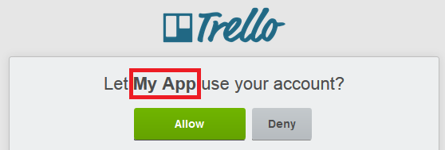

# Owin.Security.Providers.Trello

A Trello OAuth provider for OWIN to use with ASP.NET.

## Installation

Install via NuGet:

    Install-Package Owin.Security.Providers.Trello

## Getting Started

Before you can use this provider you need an API key from Trello. Refer to the [Trello documentation](https://trello.com/docs/gettingstarted/index.html#getting-an-application-key) for instructions on how to get an API key.

Once you have a key/secret just enable the Trello provider in your OWIN authentication configuration:

    app.UseTrelloAuthentication(
        key: "YourTrelloApiKey",
        secret: "YourTrelloApiSecret",
        appName: "My App");
		
The "appName" parameter is the name that will show to your users on the Trello authorize screen:

